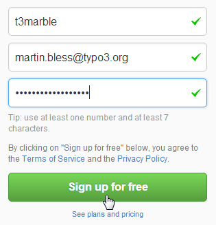
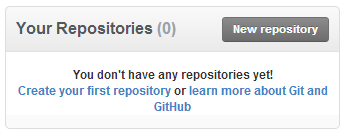

.. ==================================================
.. FOR YOUR INFORMATION 
.. --------------------------------------------------
.. -*- coding: utf-8 -*- with BOM.  Check: ÄÖÜäöüß

.. include:: ../Includes.txt

.. _details-step-1:

==================================================
Details Step 1
==================================================

Sign up for a free Github account
=================================

1: Goto https://github.com
--------------------------
.. figure:: images/step-1/001-goto-github.png
   :alt:    Goto https://github.com/
   :class:  screenshot-detail
   :align:  left

2: Sign up for free
-------------------

3. Watch the result
-------------------
Your new Github account is ready:

.. figure:: images/step-1/003-your-new-account.png
   :alt:    Your new Github account
   :class:  screenshot-detail
   :align:  left

It has no repositories yet:

   

Proceed with :ref:`quickstart-step-2`.