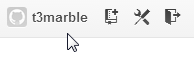
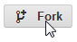

.. ==================================================
.. FOR YOUR INFORMATION 
.. --------------------------------------------------
.. -*- coding: utf-8 -*- with BOM.  Check: ÄÖÜäöüß

.. include:: ../Includes.txt

.. _details-step-2:

==================================================
Details Step 2
==================================================

Fork the 'TYPO3 Documentation Starter' repository
=================================================

(1) Goto https://github.com/
----------------------------

(2) Sign in into your account
-----------------------------
   

.. figure:: images/step-2/003-sign-in.png
   :alt:    Sign in
   :class:  screenshot-detail
   :align:  left

(3) Verify you're logged in
---------------------------
   

(4) Go to the 'TYPO3 Documentation Starter' repository
------------------------------------------------------

Go to the `TYPO3 Documentation Starter 
<https://github.com/marble/typo3-documentation-starter>`_ repository.

(5) Fork it!
------------

      

Proceed with :ref:`quickstart-step-3`.