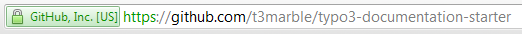
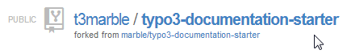
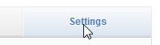
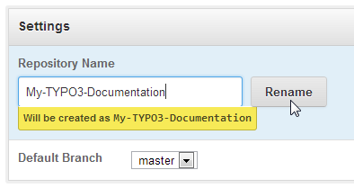

.. ==================================================
.. FOR YOUR INFORMATION 
.. --------------------------------------------------
.. -*- coding: utf-8 -*- with BOM.  Check: ÄÖÜäöüß

.. include:: ../Includes.txt

.. _details-step-3:

==================================================
Details Step 3
==================================================

Rename the repository you just forked
=====================================

Rename the repository you just forked to something you like and that
makes sense.

(1) Goto to your new repository
-------------------------------

Goto the fork of the 'TYPO3 Documentation Starter' repository
that you just created for your personal use:

   
(2) Enter the Settings for this Repository
------------------------------------------

   
(3) Choose an appropriate name
------------------------------

   

Proceed with :ref:`quickstart-step-4`.