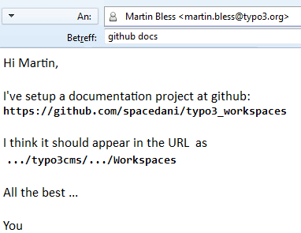

.. ==================================================
.. FOR YOUR INFORMATION 
.. --------------------------------------------------
.. -*- coding: utf-8 -*- with BOM.  Check: ÄÖÜäöüß

.. include:: ../Includes.txt

.. _details-step-4:

==================================================
Details Step 4
==================================================

Send `me <martin.bless@typo3.org>`_ an email
============================================

Send `me <martin.bless@typo3.org>`_ an email like this one:

That's it!

You may proceed with :ref:`quickstart-step-5` or read on.

Some more info about specifying a documentation project
=======================================================

Technically spoken I need enough information to extend this list 
`list-of-github-manuals.csv.txt 
<http://docs.typo3.org/~mbless/typo3-manage-github-repositories/list-of-github-manuals.csv.txt>`_
on the server:: 

  github_user      , repository_name                          , manual_name_in_url                , url_start
  marble           , typo3-manage-github-repositories         , ManageGithubRepositories          , typo3cms/drafts
  marble           , typo3-incoming-notes                     , IncomingNotes                     , typo3cms/drafts
  marble           , typo3-documentation-contribution-guide   , DocumentationContributionGuide    , typo3cms/drafts
  froemken         , typo3-extbase-guide                      , ExtbaseGuide                      , typo3cms/drafts
  froemken         , typo3-fluid-guide                        , FluidGuide                        , typo3cms/drafts
  

Minimum information for the email
---------------------------------

If it comes down to a minimum I only need::

   the url of your repository at Github like:
      https://github.com/marble/typo3-documentation-starter

   the name you would like to see for it in the url like:
      DocumentationStarter
   
As you imagine I can easily guess the rest.

Gimme a moment, please!
-----------------------

I'll react as soon as possible and respond with an email telling you
that the server now knows about your documentation project and is
willing to render it at - in this example -: 
`.../drafts/.../DocumentationStarter 
<http://docs.typo3.org/typo3cms/drafts/github/marble/DocumentationStarter>`_.

Is it online?
-------------

You can always check if the setup has already been done by inspecting 
the file `list-of-github-manuals.csv.txt 
<http://docs.typo3.org/~mbless/typo3-manage-github-repositories/list-of-github-manuals.csv.txt>`_.

Another clever way to find out about what documentation is already 
online is to assume that *drafts*, though not publicly link, could be
nevertheless there. This means: follow the lines of
`.../typo3cms/drafts/ <http://docs.typo3.org/typo3cms/drafts/>`_
`github/ <http://docs.typo3.org/typo3cms/drafts/github/>`_ user/ like 
`marble/ <http://docs.typo3.org/typo3cms/drafts/github/marble/>`_ ...

Proceed with :ref:`quickstart-step-5`.